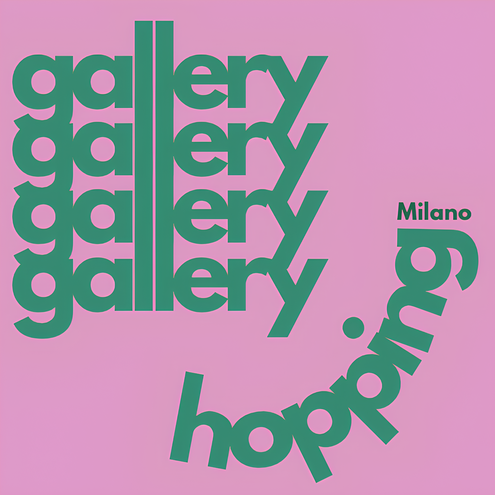

<html lang="en">
<head>
    <meta charset="UTF-8">
    <meta name="viewport" content="width=device-width, initial-scale=1.0">
    
</head>
<body>

Porta Venezia walking tour — Saturday, 1st February

   

    <a href="https://www.instagram.com/galleryhopping.milano?igsh=dTJ3dHVjNTY2dWc1" target="_blank" class="dark-green capitalized">
        Instagram
    </a>

  

  

    <a href="your-newsletter-link-here" target="_blank" class="dark-green capitalized">
        Newsletter
    </a>

     

&copy; 2025 gallery hopping Milano

</body>
</html>

